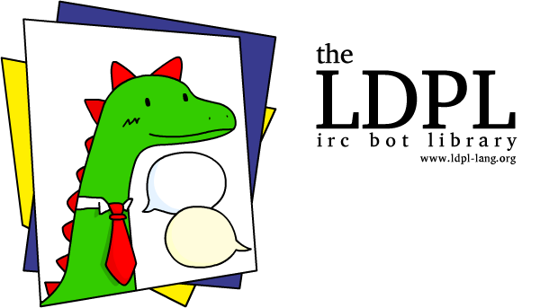

**The LDPL IRC Bot Library** is a super easy to use IRC bot library for [LDPL](https://www.github.com/lartu/ldpl).
It lets you write LDPL programs that connect to IRC servers, join channels, send messages and react to received messages in the simplest
way possible. This library requires **LDPL 4.3** or greater.

## 🧰 Usage

Include the library into your LDPL project by copying the folder *ldpl-irc-bot* to your project directory and then adding the line:

```coffeescript
include "ldpl-irc-bot/ldpl_irc_bot.ldpl"
```

before the `data` and `procedure` sections of your source file. The library is
ready to be used.

## 📚 Documentation

This library adds five new statements to the language:
 - `irc set nick <text>` sets `<text>` as the nick of your IRC bot.
 - `irc set server <text> on port <text>` sets the server and port your bot will connect to.
 - `irc add channel <text>` adds a channel to the list of channels your bot will join when it connects to the server.
 - `irc start bot` connects your bot to the IRC server and then joins all the specified channels.
 - `irc send <text> to <text>` sends `<text>` to the channel or user named `<text>`.
 
This library also requires you to define the following subprocedures:
### `ircbot.onmessage`
This sub is executed when your bot receives a message (both privately or on a channel). `msg_text` contains the message that was received, `msg_from` contains the nick of the user who sent the message and `msg_channel` contains the name of the channel the message was sent to (or the nick of your bot if it was a direct message).
```coffeescript
sub ircbot.onmessage
    parameters:
        msg_text is text
        msg_from is text
        msg_channel is text
    procedure:
        # ...
end sub
```

### `ircbot.onjoin`
This sub is executed when someone joins a channel your bot is in. `join_name` contains the nick of the user who joined and `join_channel` contains the name of the channel they joined.
```coffeescript
sub ircbot.onjoin
    parameters:
        join_name is text
        join_channel is text
    procedure:
        # ...
end sub
```

### `ircbot.onpart`
This sub is executed when someone leaves a channel your bot is in. `part_name` contains the nick of the user who left and `part_channel` contains the name of the channel they parted from.
```coffeescript
sub ircbot.onpart
    parameters:
        part_name is text
        part_channel is text
    procedure:
        # ...
end sub
```

## 🏫 Example
The file `example-bot.ldpl` contains an example bot written using this library.

## 🎁 Contributing
If you add any features to the library that you'd like to share, be sure to ring us with a pull request and we'll add them to the library! Every contribution is welcome!

## ⚖ License
The LDPL IRC Bot Library is heavily based on [**SirLogsalot**](https://github.com/gkbrk/SirLogsalot)
by [Gokberk Yaltirakli](https://github.com/gkbrk). His code is released under the *MIT License*
and so is this library.
